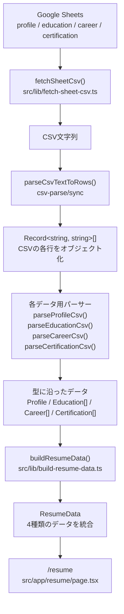

# Resume データフロー

Google Sheets の履歴書データが、Next.js の `/resume` で表示されるまでの流れを示します。

## 読み方

- **取得**: `fetchSheetCsv()` が Google Sheets を CSV 文字列として取得する。
- **共通解析**: `parseCsvTextToRows()` が CSV を `Record<string, string>[]` に変換する。
- **用途別変換**: 各 `parse*Csv()` が行データを履歴書用の型へ整える。
- **統合**: `buildResumeData()` が4種類のデータを `ResumeData` にまとめる。
- **表示**: `/resume` が `ResumeData` を使って画面を描画する。

## 司令塔

`buildResumeData()` がこの処理全体のオーケストレーターです。

内部では `Promise.all()` を使い、profile / education / career / certification の4シートを並列取得してから、それぞれを解析・統合します。
