# Resume データフロー

Google Sheets のデータが、Next.js の履歴書画面へ届くまでを **実際のファイル名・関数名・型名と対応させて** 図式化します。

このドキュメントでは、単なる依存関係ではなく、

```text
どこからデータが来る
→ どの関数で何に変わる
→ どの型になる
→ どの画面で使われる
```

を追えることを目的にしています。

---

## 1. 全体像

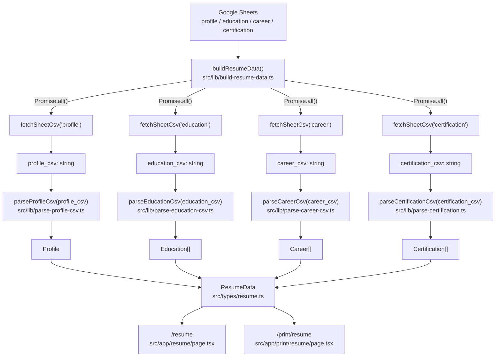

### コード上の中心

`buildResumeData()` が司令塔です。

実コードでは4つのCSV取得を `Promise.all()` で同時に開始します。

```ts
const [
  profile_csv,
  education_csv,
  career_csv,
  certification_csv,
] = await Promise.all([
  fetchSheetCsv("profile"),
  fetchSheetCsv("education"),
  fetchSheetCsv("career"),
  fetchSheetCsv("certification"),
]);
```

取得後、それぞれ専用パーサーへ渡します。

```ts
const profile = parseProfileCsv(profile_csv);
const education = parseEducationCsv(education_csv);
const career = parseCareerCsv(career_csv);
const certification = parseCertificationCsv(certification_csv);
```

最後に `ResumeData` として統合します。

```ts
return {
  profile,
  education,
  career,
  certification,
};
```

---

## 2. Google Sheets → CSV文字列

対象ファイル:

```text
src/lib/fetch-sheet-csv.ts
```

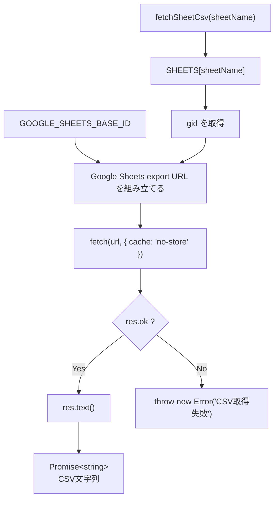

### 使用する環境変数

```text
GOOGLE_SHEETS_BASE_ID
GOOGLE_SHEET_PROFILE_GID
GOOGLE_SHEET_EDUCATION_GID
GOOGLE_SHEET_CAREER_GID
GOOGLE_SHEET_CERTIFICATION_GID
```

`sheetName` は次の4種類だけを受け取れます。

```ts
"profile"
"education"
"career"
"certification"
```

これは `keyof typeof SHEETS` によって TypeScript 側で制限されています。

---

## 3. CSV文字列 → 共通の行データ

対象ファイル:

```text
src/lib/parse-csv-text-to-rows.ts
```

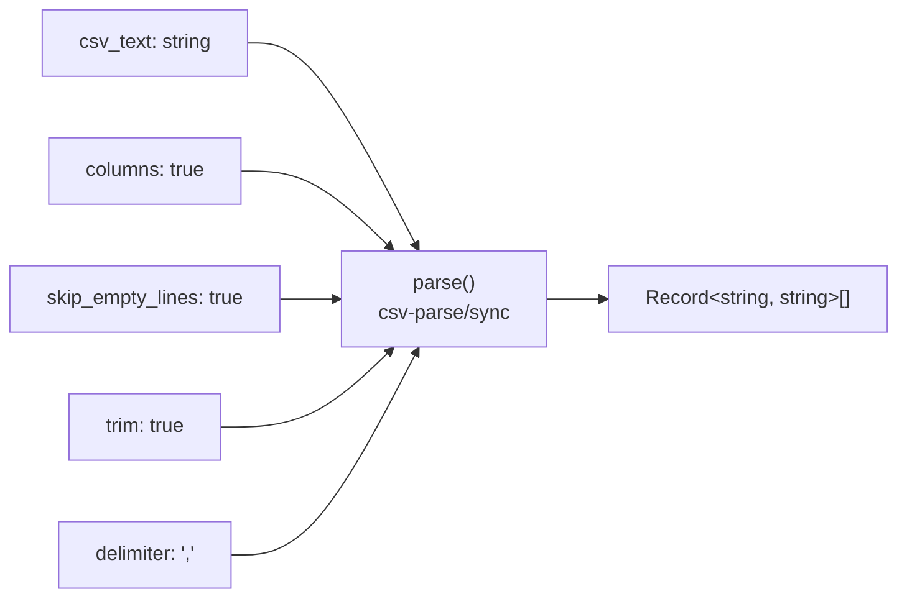

実コード:

```ts
export function parseCsvTextToRows(
  csv_text: string
): Record<string, string>[] {
  return parse(csv_text, {
    columns: true,
    skip_empty_lines: true,
    trim: true,
    delimiter: ",",
  });
}
```

### ここで何が変わるか

入力:

```csv
id,name
1,Leon
2,Tanaka
```

出力イメージ:

```ts
[
  { id: "1", name: "Leon" },
  { id: "2", name: "Tanaka" },
]
```

この時点ではまだ `Career` や `Education` ではありません。

型としては単純な、

```ts
Record<string, string>[]
```

です。

---

## 4. 共通行データ → 履歴書用の型

4種類すべての専用パーサーが、まず `parseCsvTextToRows()` を呼びます。

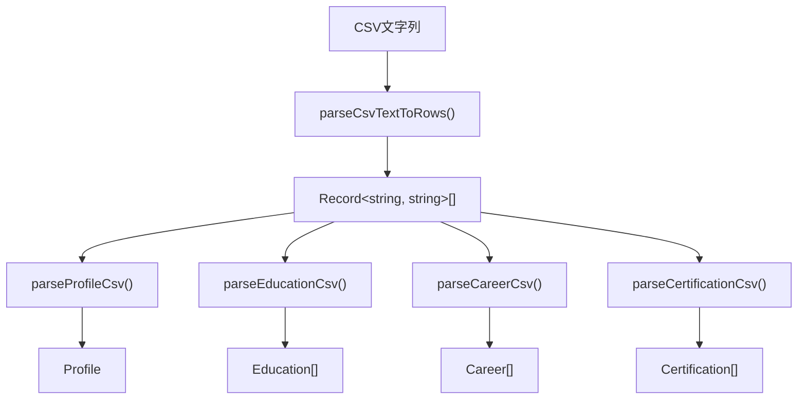

実際には各CSVごとに `parseCsvTextToRows()` が1回ずつ実行されます。

---

## 5. Profileだけ変換方法が違う

対象ファイル:

```text
src/lib/parse-profile-csv.ts
src/types/profile.ts
```

Profileシートは **縦持ちの key-value 形式**です。

イメージ:

```csv
key,value
name,Leon.C
title,Web Developer
email,example@example.com
```

処理:

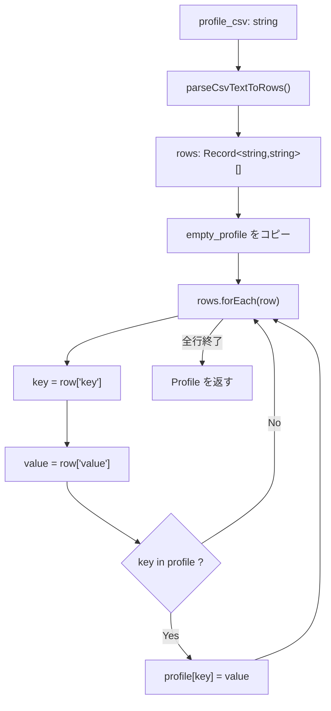

`empty_profile` は `src/types/profile.ts` にあり、すべての項目を空文字で持った `Profile` の初期値です。

主な項目:

```text
name
furigana
title
tagline
summary
email
phone
nearest_station
github_url
portfolio_url
wanted_job
commuting_time
...
```

---

## 6. Education / Career / Certification は横持ち

この3種類はCSVの1行が、そのまま1件のデータになります。

### Education

対象:

```text
src/lib/parse-education-csv.ts
src/types/education.ts
```

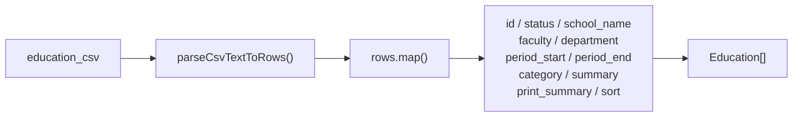

### Career

対象:

```text
src/lib/parse-career-csv.ts
src/types/career.ts
```

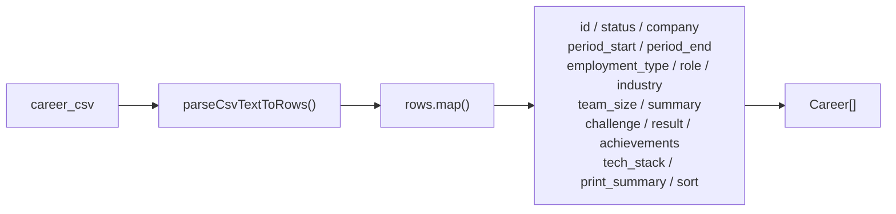

### Certification

対象:

```text
src/lib/parse-certification.ts
src/types/certification.ts
```

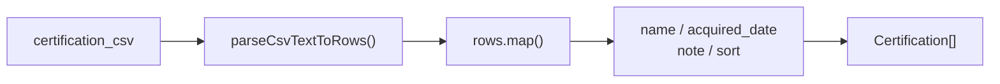

---

## 7. 最終的な ResumeData

対象ファイル:

```text
src/types/resume.ts
```

```ts
export interface ResumeData {
  profile: Profile;
  education: Education[];
  career: Career[];
  certification: Certification[];
}
```

図にすると:

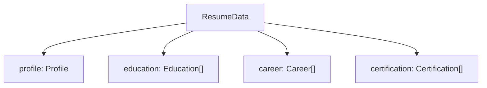

ここまで来ると、画面側はCSVを意識する必要がありません。

画面は、

```ts
resume.profile.name
resume.education
resume.career
resume.certification
```

のように、TypeScriptのデータとして利用できます。

---

## 8. 画面側

### Webレジュメ

対象:

```text
src/app/resume/page.tsx
```

冒頭で、

```ts
const resume = await buildResumeData();
```

を実行します。

その後、

```text
resume.profile
resume.education
resume.career
resume.certification
```

を JSX へ渡して表示します。

### 印刷用レジュメ

対象:

```text
src/app/print/resume/page.tsx
```

こちらも同じく、

```ts
const resume = await buildResumeData();
```

を実行します。

つまり **Web表示と印刷表示は同じデータ取得・変換処理を共有**しています。

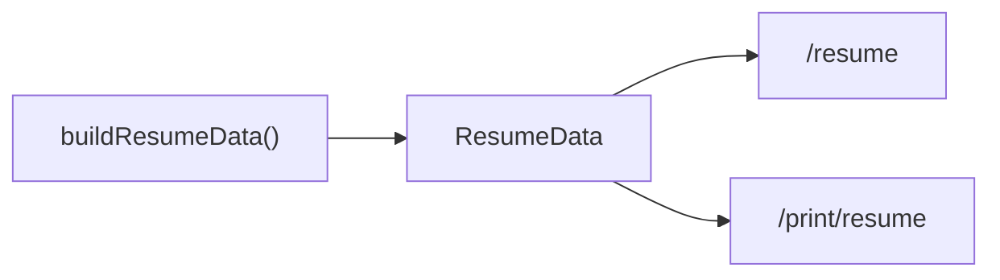

---

## 9. ファイルと責務の対応表

| ファイル | 主な関数 / 型 | 責務 |
|---|---|---|
| `src/lib/build-resume-data.ts` | `buildResumeData()` | 全体の司令塔。取得・解析・統合 |
| `src/lib/fetch-sheet-csv.ts` | `fetchSheetCsv()` | Google SheetsからCSV取得 |
| `src/lib/parse-csv-text-to-rows.ts` | `parseCsvTextToRows()` | CSV文字列を共通の行オブジェクトへ変換 |
| `src/lib/parse-profile-csv.ts` | `parseProfileCsv()` | key-value形式を `Profile` へ変換 |
| `src/lib/parse-education-csv.ts` | `parseEducationCsv()` | 行データを `Education[]` へ変換 |
| `src/lib/parse-career-csv.ts` | `parseCareerCsv()` | 行データを `Career[]` へ変換 |
| `src/lib/parse-certification.ts` | `parseCertificationCsv()` | 行データを `Certification[]` へ変換 |
| `src/types/profile.ts` | `Profile`, `empty_profile` | Profileの型と初期値 |
| `src/types/education.ts` | `Education` | 学歴データの型 |
| `src/types/career.ts` | `Career` | 職歴データの型 |
| `src/types/certification.ts` | `Certification` | 資格データの型 |
| `src/types/resume.ts` | `ResumeData` | 4種類のデータを束ねる型 |
| `src/app/resume/page.tsx` | `ResumePage()` | Webレジュメ表示 |
| `src/app/print/resume/page.tsx` | `PrintResumePage()` | 印刷用レジュメ表示 |

---

## 10. 不具合が出たときの切り分け順

「履歴書の表示がおかしい」ときは、画面から逆向きに追います。

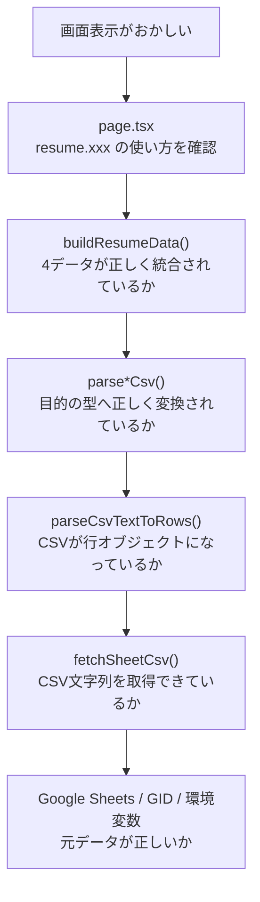

### 覚えるべき一本線

```text
Google Sheets
↓
fetchSheetCsv()
↓
CSV文字列
↓
parseCsvTextToRows()
↓
Record<string, string>[]
↓
parse*Csv()
↓
Profile / Education[] / Career[] / Certification[]
↓
buildResumeData()
↓
ResumeData
↓
page.tsx
```

この一本線が理解できれば、細かいコードを暗記していなくてもデータの流れを追えます。
